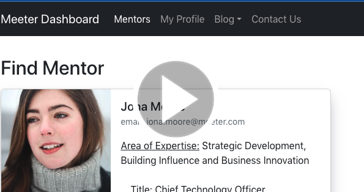
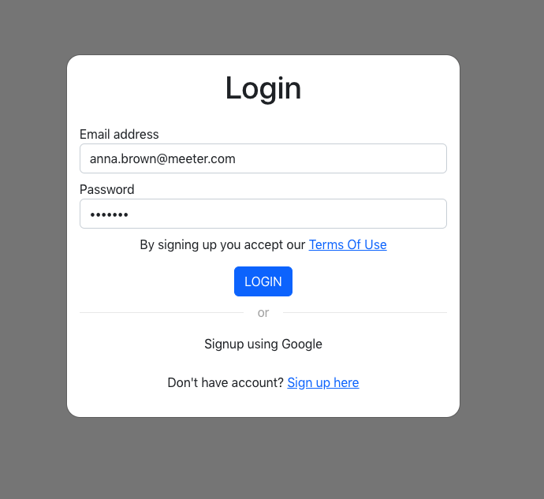
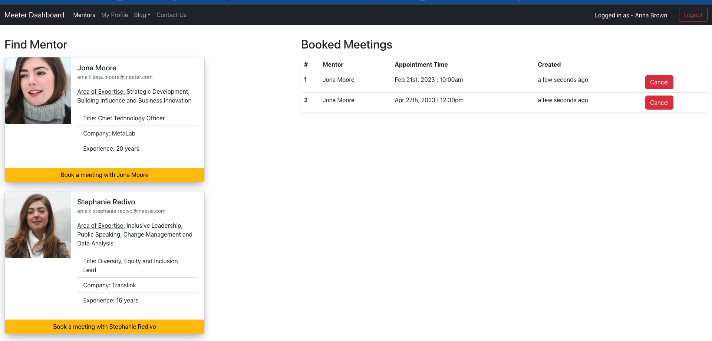
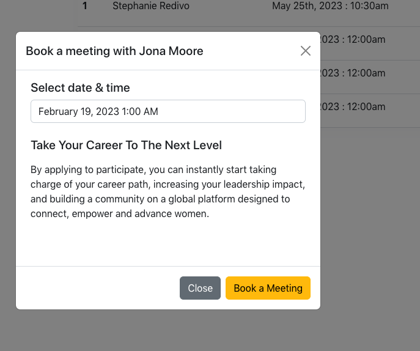
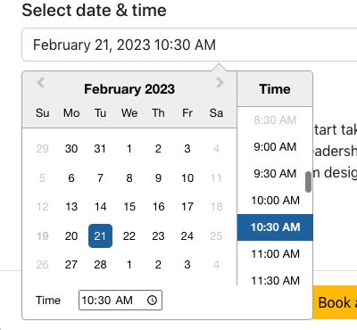
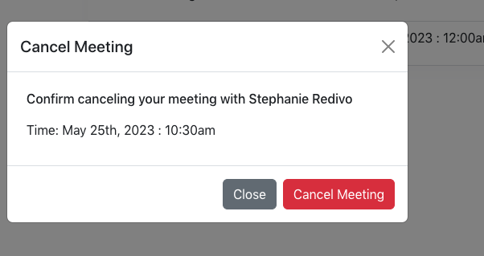
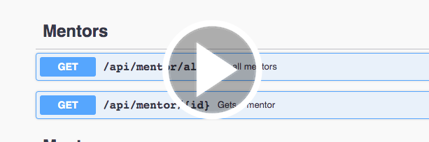
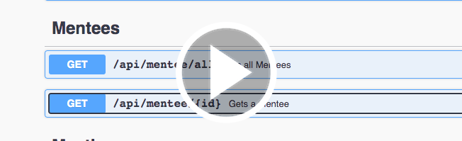
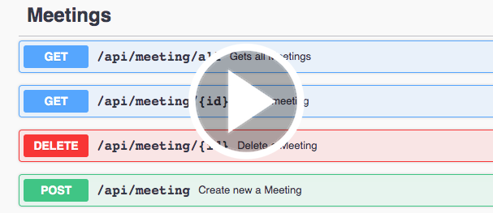

# meeter
Meeting scheduler application for mentors and mentees.
Used technologies (Postgres, Express, React, Node).

# Meeter build and start application
1. Run Postgres DB through Docker env 
```
  docker-compose up
```
or installed locally (run on port 5430)
https://www.postgresql.org/download/
2. Create database:
```
CREATE USER meeter WITH PASSWORD 'meeter';
CREATE DATABASE meeter;
GRANT ALL PRIVILEGES ON DATABASE meeter to meeter;
```
3. Run Backend server as a NodeJs App, Frontend as React App

```
npm run start:nodemon
```
Run Frontend as React App
```
npm run start
```
4. Swagger API Doc are available at http://localhost:{port}/api/docs

## View Meeter App demo video
_**Use a CTRL+click (on Windows and Linux) or CMD+click (on MacOS) to open video in the new tab._**

[](https://watch.screencastify.com/v/KOaLXR9Ffsl4moY9RI7Z "Meeter Demo Video")

#### Login Page:
Demo user login without authentication



#### Dashboard Page:
Upon logging in user gets redirected to the Dashboard where he can book an appointment with a Mentor



#### Book A Meeting with Mentor:
The modal form to book a meeting with specific Mentor




#### Select Date and Time for Your Meeting:
User can select an available weekday and a timeslot for booking a meeting.
After clicking Book a Meeting button, the new meeting will be added to the table on the Dashboard



#### Cancel Your Meeting
User can cancel a meeting clicking on the Cancel button, the meeting will disappear form the table.



## View API calls executed in Swagger:
_**Use a CTRL+click (on Windows and Linux) or CMD+click (on MacOS) to open video in the new tab._**

[](https://watch.screencastify.com/v/sXpJrzGhPZD0ivcz74qa "Mentor APIs")

[](https://watch.screencastify.com/v/mGVxp3pliyFvPg2xav1E "Mentee APIs")

[](https://watch.screencastify.com/v/JJvbCKe5PotJshv8SqYR "Meeting APIs")

##### Technologies used in this Project:
| Backend Server:                                                             |Frontend UI: |
|-----------------------------------------------------------------------------| ------------- |
| NodeJS                                                                      | React |
| Express                                                                     | TypeScript |
| Postgres DB                                                                 | Axios |
| Liquibase - for database versioning and migration                           | Bootstrap UI v5 |
| Sequelize - ORM (object relational model) tool for DB modelling and queries | Node Sass |
| Swagger - for API Endpoints documentation and testing                       |React Datepicker |
| Other tools: Linter, Prettier, UUID, etc..                                  | React Moment |


