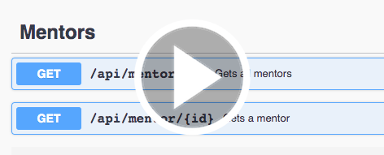
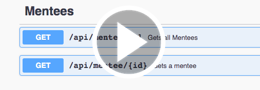
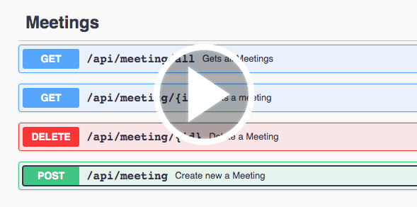

# meeter
Meeting scheduler application for mentors and mentees.
Used technologies (Postgres, Express, React, Node).

# Meeter build and start application
1. Run Postgres DB through Docker env 
```
  docker-compose up
```
or installed locally (run on port 5430)
https://www.postgresql.org/download/
2. Create database:
```
CREATE USER meeter WITH PASSWORD 'meeter';
CREATE DATABASE meeter;
GRANT ALL PRIVILEGES ON DATABASE meeter to meeter;
```
3. Run Backend server as a NodeJs App, Frontend as React App

```
npm run start:nodemon
```
4. Swagger API Doc are available at http://localhost:{port}/api/docs
## View API calls executed in Swagger:
[](https://watch.screencastify.com/v/sXpJrzGhPZD0ivcz74qa "Mentor APIs")

[](https://watch.screencastify.com/v/mGVxp3pliyFvPg2xav1E "Mentee APIs")

[](https://watch.screencastify.com/v/JJvbCKe5PotJshv8SqYR "Meeting APIs")


